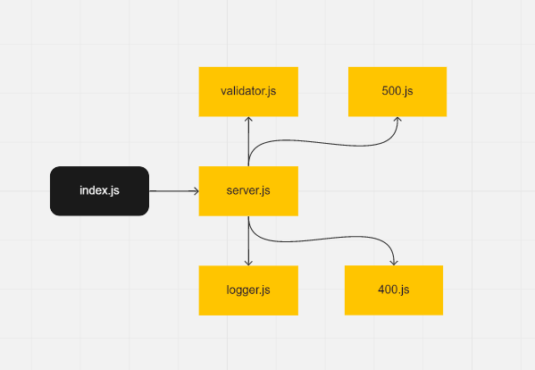

# basic-express-server-class02/lab 2 

## Setup : 
- .env /PORT=3000 

## Test : 
- npm test 

## Running the app: 
-npm run dev 

## Deployment Test : 
- Heroku :https://basic-express-server-essam.herokuapp.com/ 
- Backend: https://github.com/essamomar93/basic-express-server
- Pull request : 
  1. https://github.com/essamomar93/basic-express-server/pull/1 
  2. 

## Languages : 
- javascript 

UML:   

